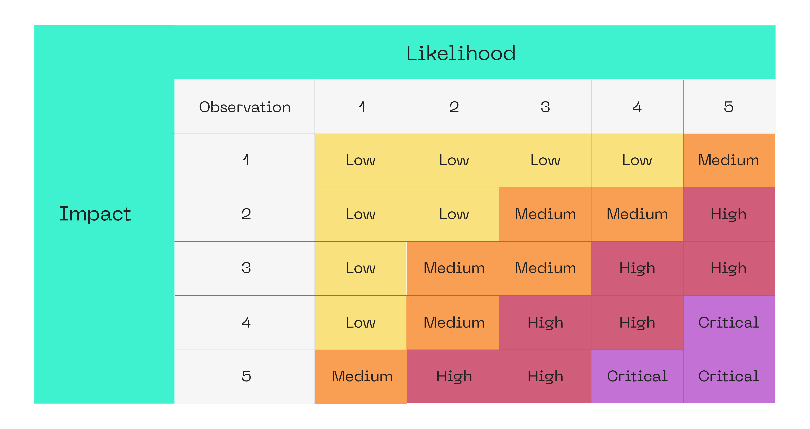

# Blockchain Protocol and Security Analysis Methodology
Release: Version 2.0

## Table of Contents

1. [Document](#document)
2. [Background to the Layer 1 Protocol Audit and Analysis](#part-1-background-to-the-layer-1-protocol-audit-and-analysis)
   - [Overview](#overview)
      - [Executive Summary](#executive-summary)
      - [Introduction](#introduction)
      - [Glossary](#glossary)
   - [The value of base blockchain audit](#the-value-of-base-blockchain-audit)
      - [How Does the Audit Help?](#how-does-the-audit-help)
3. [Layer 1 Audit and Analysis Phases](#part-2-layer-1-audit-and-analysis-phases)
   - [Preparations for Layer 1 Audit and Analysis](#preparations-for-layer-1-audit-and-analysis)
      - [Why are preparations so important?](#why-are-preparations-so-important)
      - [Functional requirements](#functional-requirements)
      - [Technical description](#technical-description)
         - [Documentation to set up and run locally](#documentation-to-set-up-and-run-locally)
         - [Unit tests](#unit-tests)
      - [Documentation Requirement](#documentation-requirement)
   - [Code Review and Analysis](#code-review-and-analysis)
      - [Overall review](#overall-review)
      - [Scan by automated tools](#scan-by-automated-tools)
      - [Process Flow Diagrams (PFDs) and Data Flow Diagrams (DFDs)](#dfds)
      - [Line-to-line review](#line-to-line-review)
   - [Testing](#testing)
      - [Analysis of received data](#analysis-of-received-data)
   - [Report](#report)
   - [Remediation Check](#remediation-check)
   - [Issue Status](#issue-status)
   - [Vulnerabilities Severity Formula](#vulnerabilities-severity-formula)

---

# Document
| Name | Smart Contract Code Review And Security Analysis Methodology |
| ----------- | ----------- |
| Creators  | Hacken OU |
| Subject  | Audit; security analysis; layer 1; layer 2; protocols; |
| Description  | The methodology described herein provides specific guidance on how to plan and execute an audit of layer 1 protocols developed by the Hacken OU. This document will enable everyone to get an understanding of an audit and realize how to be prepared for this process. |
| Contributor  | Luciano Ciattaglia | Director of Services, Hacken OU |
| Contributor  | Sofiane Akermoun | L1 Researcher and Auditor, Hacken OU |
| Contributor  | Bartosz Barwikowski | L1 Researcher and Auditor, Hacken OU |
| Date  | September 13th, 2024 |
| Rights  | Hacken OU |

---

# Part 1. Background to the Layer 1 Protocol Audit and Analysis

## Overview
### Executive summary
The Layer 1 Audit and Analysis Framework (L1AAF) constitutes a response to the Hacken customers’ requests and is based on years of experience in conducting blockchain protocol audits. The purpose of this document is to explain to the Hacken customers and community the audit process and artifacts to increase the quality of layer 1 & layer 2 development and save the funds of Hacken customers and their users.  

### Introduction
The methodology described herein provides specific guidance on how to plan and execute an audit of the protocol architecture in line with the L1AAF. This methodology is also aimed at facilitating the hiring of new auditors for the Hacken team.

### Glossary
The definitions listed below identify specific meanings attributed to common terms within the context of the Layer 1 Audit and Analysis Framework.

| Name | Description |
| ----------- | ----------- |
| Auditor  | A representative assigned to identify and assess the current state of Customers’ protocols to rate their security level and make recommendations on how to increase it. |
| Automated tools  | Programs used by auditors to detect low-severity issues in the code under audit. |
| Bugs  | Issues and security flaws detected in the code that can be exploited by malicious actors. |
| Customer  | The project that has applied for a layer 1 or layer 2 audit. |
| Lead auditor  | The officer responsible for supervising and verifying the work performed by auditors during the audit process.  |
| Main auditor  | A senior-level auditor responsible for code review and audit tests. |
| Remediation checks  | The review of the protocol by an auditor after fixes have been introduced by a customer. |

## The value of base blockchain audit 
The blockchain protocol (also known as Layer 1) is the foundational layer of Web 3.0. The number of protocols and chains has been on the rise. These projects serve as the foundation for building decentralized applications, and they require a high level of security to ensure the integrity of the entire system.

The importance of security audits in layer 1 projects cannot be overstated. A security breach here can have far-reaching consequences, affecting the entire network and causing significant damage to the blockchain ecosystem. Therefore, security audits are essential to ensure that the blockchain protocols are secure, stable, and reliable, and that they can be trusted to support the growth and development of decentralized applications.

A security audit is a systematic process that involves evaluating the security of the blockchain system to identify and mitigate potential vulnerabilities. This process involves reviewing the code, testing the system, and evaluating the overall security to ensure that the system meets industry standards and best practices. Regular audits also keep the system up-to-date with the latest security threats and trends, ensuring its longevity and resilience against attacks.

### How does the audit Help?
Most developers need guidance on how to write secure and high-quality protocols. Our methodology will serve the needs of our customers, their technical teams, and their potential clients (community).

**Our methodology will allow product owners to:**
1. Make sure that the development corresponds to the specified functional requirements.
2. Realize what steps need to be taken prior to the audit.
3. Realize what steps need to be taken during the audit.
4. Realize what steps need to be taken after the audit. 

 

**The value of our methodology for developers:**
1. It allows them to understand the audit process and its phases.
2. Provides recommendations on how to ensure secure development. 
3. Describes the most common mistakes.
4. Provides best practices of how to develop safe code.

# Part 2. Layer 1 Audit and Analysis Phases
**Layer 1 Audit and Analysis process consist of the following phases:**

1. Preparations for the audit
2. Code review and analysis
3. Testing
4. Report
5. Remediation check

## Preparations for Layer 1 Audit and Analysis
### Why are preparations so important?
Preparation for an audit is as necessary as the audit itself. 

During the preparation, customers review their projects to make sure everything they have planned is correctly implemented. At this stage, clients themselves can detect many issues. 

**To get maximum value from the audit, clients should make the following:**

1. Prepare functional requirements for the project.
2. Prepare documentation on how to set up the development environment and run the project locally.
3. Prepare functional and non-functional tests with detailed instructions(Unit tests, Integration tests, Stress Tests, etc).
4. Ensure the project's documentation is updated and covers all necessary details before the audit starts.

### Functional requirements
To understand the needs of the Customer and to ensure that everything is developed as planned, providing functional requirements is important.

The main question that should be answered here is: what do we want to achieve via this new protocol? 

Functional requirements can be both quantitative and qualitative in nature. They need to be clear, simple, and unambiguous, including details such as specific functionality, performance requirements, security features, usability, and compatibility with other systems or protocols.

User stories can be useful as well. 

### Technical description
A detailed and comprehensive explanation of the various technical aspects and requirements of a project is needed. It should contain information about:

- Used programming languages and technologies.
- Deployment instructions.
- Instructions on how to run tests. 
- Diagrams of the components and their relations.
- Specificities of implementation of certain components.
- High-level description of component functionality.
- Pros and cons of the design, motivation behind it.

Non-functional requirements can also be included in this section.

### Documentation to set up and run locally
A development environment for the project should be configured by the Customer. Specifications on how to build, run and operate the network locally are required in order to correctly perform the audit. Dockerfiles are appreciated for this step and for the whole audit.

### Unit tests
The code should be covered with unit tests. Test coverage should be 70%, with both positive and negative cases covered, and should also cover edge cases. Good test coverage means that components are easy to test with a good level of abstraction.

We recommend using TDD during the development process.

### Documentation Requirement
Good documentation is crucial in a blockchain project as it helps to ensure the transparency, accountability, and overall quality of the project. Proper documentation can provide a clear understanding of the project's design, architecture, security measures, and implementation details, making it easier for security auditors to assess the project's security posture.

Without good documentation, security auditors will spend more time breaking down the internals of the project, resulting in less time doing actual analysis and auditing, resulting in the possibility of missing some important vulnerabilities. This can lead to a less thorough and less accurate security assessment, which will negatively impact the overall security of the project.

Moreover, poor documentation can also create confusion and miscommunication among stakeholders, such as developers, project managers, and end-users, which can result in errors and delays in the development process. Furthermore, it can make it more difficult for new team members to quickly ramp up and understand the project, potentially causing further delays and disruptions.

In conclusion, good documentation is a crucial aspect of a secure and well-functioning blockchain project. It provides the necessary information for security auditors to thoroughly assess the security posture of the project and helps to ensure the transparency and accountability of the project to all stakeholders.

## Code review and analysis
Code review and analysis are performed by the main auditor during the initial phase of an audit.  Additional reviews are also performed by all team members to verify that no critical or high severity issues are present in the code. The steps of this process are:

1. Overall review
2. Scan by automated tools
3. Funds and data flow diagrams
4. Line-to-line review
5. Testing
6. Analysis of received data

### Overall review
At this step, the main auditor reads the code to understand its structure and purpose.  Functional and technical requirements, as well as other documents provided by clients are examined in detail. No serious findings can be detected at this step. The main outcome of this step is a high-level description of the code provided by auditors. Those deliverables are used internally during the next steps of the audit.

### Scan by automated tools
Automated tools are used to search for simple issues and provide more information about the structure of the protocol under review. Depending on the stack of the project, different tools may be used individually or simultaneously to search for common bugs and potential vulnerabilities.

#### Static Analysis:

- Custom configured linters
- Semgrep with customized rules
- CodeQL
- CI-based Analysis with SonarCloud
- Dependencies analyzers

#### Dynamic Analysis & debugging:

- Fuzzing
- DAST tools based on the projects´ stack

### Process Flow Diagrams (PFDs) and Data Flow Diagrams (DFDs)
At this step, auditors have more information about the code and can now build PFDs and DFDs if needed. We visualize all the components of the protocol and how they interact with each other, plus the parameters needed in order to build and process transactions, blocks, and other important aspects. These diagrams will visually demonstrate the relationships between components and processes, providing a view similar to that of an attacker. 

During this step, some issues can be found and recorded by auditors.

This allows us to better understand the protocol before line-to-line review.

BPMN and UML diagrams are used to visualize funds and data flows

### Line-to-line review
During the line-to-line review, auditors thoroughly read each line of the code of the most critical components and record every issue detected. We review components for all known issues, such as the ones described in **[BCAT](https://hacken-3.gitbook.io/l1-security)**. We also look for possible parameter manipulations, access violations, weak validations, and other manipulations that can be performed through the validation process or node interactions. This step also includes validation of the code according to code-style guides and best practices. 

## Testing
During the testing phase of the audit, if unit tests are configured for the project, auditors check coverage and write their own test cases if required. Ideally, code coverage should cover all positive and negative cases.

If unit tests are not configured, auditors build the network locally and check all required cases. 

Some sophisticated issues require complex exploiting PoCs. Usually, if it is unclear how the issue can be exploited, auditors may provide the replication script, depending on the case. 

## Analysis of received data
Auditors review their findings and share results internally. All disputable points in the code are discussed with the team. Auditors prepare materials for the report. The Lead auditor reviews all materials prepared by other auditors and add his own reviews. Most possible issues are already documented at this step.

### Report
After all code review, analysis, and tests, auditors prepare a report. Reports have the following structure:
- Introduction	
- Scope	
- Audit Summary
- System Overview	
- Risks
- Findings and Recommendations
- Definitions
- Disclaimers

## Remediation Check
All issues are reported to the Customer in the preliminary report. If some points are unclear, we can provide more descriptions of issues or explain everything on a call.

The customer is entitled to one complimentary remediation check if the following conditions are met:
- **Timely Response:** Remedial actions must be implemented within the specified timeframe dictated by the Lead Auditor.
- **Code Integrity:** The fundamental code structure should remain unchanged. Major architectural modifications may disqualify the customer from a free remediation check.
- **Documentation:** All modifications to the code must be comprehensively documented by the customer, detailing what changes were made and why.
- **Commit Specificity:** The submitted commits must exclusively address the vulnerabilities or issues that were identified in the "Findings" section of the preliminary report.

Fixes must be submitted in a structured list, detailing the Finding ID and the corresponding commit hash.

After all fixes are validated, a final report is provided to the customer.

## Issue status
During the auditing, an issue can have one of the following statuses:
- **Pending Fix:** An issue newly discovered by the auditing team, not fixed yet.
- **Resolved:** An issue that has been resolved based on the auditor's recommendations. 
- **Accepted:** This status is assigned to an issue that the customer has recognized but chosen not to fix, either because it is deemed an intentional feature or it has been consciously ignored. While the issue remains unaddressed, it has been formally acknowledged by the client. 
- **Mitigated:** Changes that partially address an issue or implement a safeguard that reduces risk but does not fully eliminate the vulnerability.

> Hacken assumes no liability for any security breaches or vulnerabilities ("rekt" cases) that may arise due to these unresolved or partially resolved issues.

# Vulnerabilities severity formula
