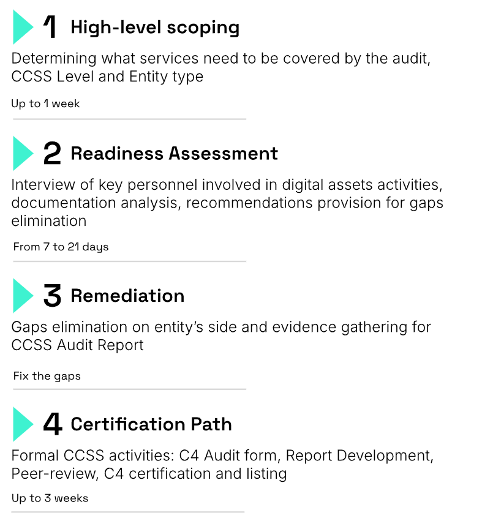

# CCSS Audit Methodology
Release: Version 3.1

## Table of Contents

1. [Intro](#intro)
   - [Purpose of the document](#purpose-of-the-document)
   - [Our expertise and commitment](#our-expertise-and-commitment)
   - [Tailored solutions and ongoing support](#tailored-solutions-and-ongoing-support)
2. [CCSS in Depth](#ccss-in-depth)
   - [What is the CCSS?](#what-is-the-ccss)
   - [Why would your organization need it?](#why-would-your-organization-need-it)
   - [Who needs the CCSS Audit?](#who-needs-the-ccss-audit)
   - [CCSS Entities Certification Types](#ccss-entities-certification-types)
   - [CCSS Certification Levels](#ccss-certification-levels)
3. [Elevating the CCSS](#elevating-the-ccss)
4. [Hacken’s CCSS Way](#hackens-ccss-way)
   - [Own CCSS Approach](#own-ccss-approach)
   - [Readiness Assessment and Certification](#readiness-assessment-and-certification)
   - [Our CCSS Process](#our-ccss-process)
5. [Deliverables](#deliverables)

---

# Intro

## Purpose of the document
The Hacken team specialize in providing comprehensive support and guidance to organizations seeking Cryptocurrency Security Standard (CCSS) certification. This document serves as our CCSS Audit Methodology, detailing how we prepare our clients for successful CCSS audits.

## Our expertise and commitment
At Hacken, we understand the critical importance of security in the cryptocurrency industry. Our team consists of highly skilled professionals with extensive knowledge and experience in cryptocurrency security and CCSS requirements. We are committed to helping our clients navigate the complexities of CCSS and prepare for successful audits that validate their adherence to industry best practices.

## Tailored solutions and ongoing support
We understand that every organization has unique requirements and challenges. The Hacken team is dedicated to providing tailored solutions and ongoing support throughout the CCSS certification journey. We work closely with our clients to develop and implement robust security controls, establish comprehensive policies and procedures, and ensure readiness for the CCSS audit.

In the following sections, we will delve into the details of our CCSS Audit Methodology, outlining the steps and considerations involved in preparing for a successful CCSS audit. Our goal is to empower your organization with the knowledge and tools necessary to achieve CCSS certification and demonstrate your commitment to the highest standards of cryptocurrency security.

---

# CCSS in Depth

## What is the CCSS?
The CryptoCurrency Security Standard (CCSS) is the industry benchmark for establishing and maintaining robust security practices in the cryptocurrency space, ensuring the protection of digital assets and instilling trust among stakeholders.

- The first security standard designed to protect cryptocurrency assets from various security threats.
- CCSS requirements are divided into 3 Levels (Each next level is more stringent in securing key management processes).
- Does not replace existing standards in the field of information security, but rather a complement field

## Why would your organization need it?
The CCSS audit is crucial for organizations to assess and strengthen their security practices, identify vulnerabilities, and safeguard their valuable digital assets in the ever-evolving cryptocurrency landscape.

- Reducing the risk of losing cryptocurrencies as a result of attacks and other security threats.
- Improvin( customer reputation and trust by demonstrating high security standards.
- Compliance with the requirements of partners and service providers or the security of using digital assets.

## Who needs the CCSS Audit?
- **Cryptocurrency Exchanges:** Exchanges that facilitate the trading of cryptocurrencies need to prioritize security to protect user funds, prevent unauthorized access, and ensure the integrity of trading platforms.
- **Digital Wallet Providers:** Organizations offering digital wallets for storing and managing cryptocurrencies must implement robust security measures to safeguard users' private keys and prevent unauthorized transactions or wallet compromises.
- **Blockchain Platforms:** Companies involved in blockchain development or providing blockchain-based services should undergo a CCSS audit to ensure the security and integrity of their blockchain networks, smart contracts, and associated infrastructure.
- **Cryptocurrency Custodians:** Custodial services that hold cryptocurrencies on behalf of clients must adhere to strict security protocols to prevent theft, implement secure storage solutions, and maintain the confidentiality of client assets.

## CCSS Entities Certification Types
| CCSS certification types | Common examples |
| ----------- | ----------- |
| **Self-custody**  | Online stores which accept payments in cryptocurrency |
| **Qualified Service Providers**  | Key, Wallet and Transaction management Service providers |
| **Full-system**  | CEXs that incorporates service providers into their system |

## CCSS Certification Levels
When it comes to securing your organization's digital assets, one size doesn't fit all. That's why the CryptoCurrency Security Standard (CCSS) offers different certification levels, each progressively raising the bar on security requirements. Whether you're just starting or looking to take your security to the next level, CCSS certification has you covered. 

The CCSS provides the ability to be certified as one of the three security levels (from 1 to 3) where with each next level the security requirements applied to your system will be more stringent.

---

# Elevating the CCSS
At Hacken, we understand that obtaining a CryptoCurrency Security Standard Auditor (CCSSA) certification is just the beginning of ensuring comprehensive security in the cryptocurrency industry. That's why our CCSS methodology  goes above and beyond by combining industry-leading standards and technical expertise.

Unlike traditional CCSS audits, our approach recognizes that a CCSSA certificate alone does not guarantee the auditor's competence. As acknowledged by the C4 consortium, the developer of the standard, CCSS serves as an additional layer of security requirements within the crypto industry, complementing existing information security frameworks.

That's where Hacken sets itself apart. Our CCSS auditors possess a solid background in conducting audits for globally recognized frameworks such as ISO27001, PCI DSS, and SWIFT. This ensures a holistic approach to security assessments, integrating CCSS seamlessly into your organization's existing security protocols.

But our expertise doesn't stop there. Hacken's auditors bring a wealth of technical security background in various services, including Blockchain Protocol Audit, Smart Contracts Audit, dApp Audit, Penetration Testing, and more. This unique combination of technical proficiency and broad industry knowledge enables us to address the complexities of securing cryptocurrencies from every angle.

We go beyond the standard requirements, offering a tailored approach that aligns with your existing security frameworks and leverages our deep understanding of blockchain technologies.

---

# Hacken’s CCSS Way

## Own CCSS Approach
When it comes to cryptocurrency security, the existing CCSS audit methodology can be complex and overwhelming. That's why Hacken has developed its own CCSS approach, a streamlined approach that focuses on the essential CCSS controls and requirements, making it easier for organizations to understand and implement robust security practices.

## Readiness Assessment and Certification
One of our key strengths lies in conducting a Readiness Assessment as a crucial part of the CCSS audit process. This assessment allows our experienced Hacken Team to evaluate your organization's current security posture and determine the CCSS level you qualify for. Unlike traditional approaches, we provide you with the choice to either certify for the current CCSS level or utilize the comprehensive guidelines provided by Hacken to reach the second or even the third CCSS certification level.

At Hacken, we don't just stop at providing recommendations. We go the extra mile to ensure that your organization truly implements our guidance effectively. Through a meticulous process, we verify the implementation of our recommendations and upon completion compile a comprehensive package of certification documents, showcasing your commitment to industry-leading security practices. 

## Our CCSS Process

---

# Deliverables
The deliverable of CCSS Audit are the results of the audit stages that contain:
- Detailed Readiness Assessment Report with recommendations for eliminating identified CCSS non-compliances.
- Final Report on Compliance for C4 consortium.
- Masked Report on Compliance for CCSSA-PR.
- Certificate on Compliance.