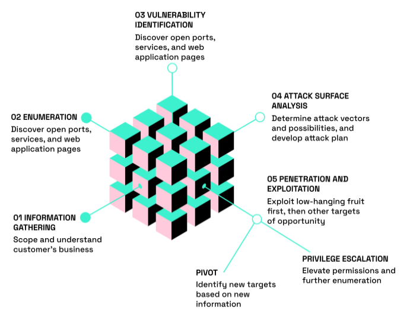
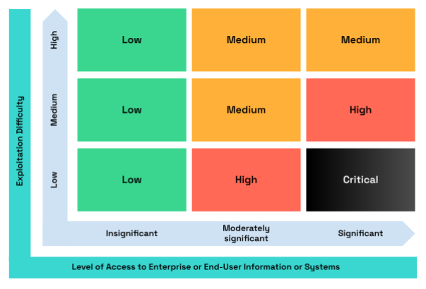

# Security Assessment Methodology
Release: Version 1.1

# Table of Contents
- [Intro](#intro)
- [Security Assessment as Proactive Security](#security-assessment-as-proactive-security)
    - [01 Multi-Cloud Penetration Testing: Fortifying Cloud Resilience across Platforms](#01-multi-cloud-penetration-testing-fortifying-cloud-resilience-across-platforms)
    - [02 Web Penetration Testing: Safeguarding Your Digital Presence](#02-web-penetration-testing-safeguarding-your-digital-presence)
    - [03 Mobile Penetration Testing: Empowering Mobile Security](#03-mobile-penetration-testing-empowering-mobile-security)
    - [04 Network Penetration Testing: Building a Resilient Infrastructure](#04-network-penetration-testing-building-a-resilient-infrastructure)
- [Fundament of Hacken's Security Assessment](#fundament-of-hackens-security-assessment)
    - [01 Used Best Practises and International Standards:](#01-used-best-practises-and-international-standards)
    - [02 Hacken's Team Individual Skills:](#02-hackens-team-individual-skills)
    - [03 Based Security Assessment Team Composition](#03-based-security-assessment-team-composition)
    - [04 Security Assessment Approach](#04-security-assessment-approach)
    - [05 Based Security Assessment Tools Kit](#05-based-security-assessment-tools-kit)
    - [06 Severity Scoring Scale](#06-severity-scoring-scale)
- [Deliverables](#deliverables)
- [Disclaimer](#disclaimer)

---

# Intro

In today's ever-evolving digital landscape, securing your organization's mobile,
web, and network assets is crucial to safeguarding sensitive information from
potential threats. Penetration testing serves as a vital component of
comprehensive cybersecurity strategies, enabling organizations to proactively
identify vulnerabilities and strengthen their defenses. This document outlines
Hacken's approach for multi-cloud, mobile, web, and network penetration
testing, providing a clear understanding of the benefits and outcomes these
assessments aim to achieve.

During the information security assessment, the Hacken team focuses on the
following goals and objectives:

- Identify technical and functional vulnerabilities.
- Estimate their severity level (ease of use, impact on information systems,
etc.)
- Modeling the "most likely" attack vectors against the Customer's
Information System.
- Proof of concept and exploitation of vulnerabilities.
- Draw up a prioritized list of recommendations to address identified
weaknesses.

---

# Security Assessment as Proactive Security

## 01 Multi-Cloud Penetration Testing: Fortifying Cloud Resilience across Platforms

Your cloud-based infrastructure acts as the backbone supporting your digital
operations. Our approach applies to the most popular cloud infrastructure
platforms such as GCP, AWS, Azure and others. With a combination of
automated tools for reviewing the environment's static configuration with
read-only access, manual testing and focus on proof of concept for each
potential attack vector from the perspective of an attacker who obtained an
initial foothold to your platform. Beginning with automated tools that
meticulously review the static configuration of your cloud infrastructure
platforms. By analyzing these settings with read-only access, we identify any
potential misconfigurations or security gaps, providing valuable insights into
your overall security posture.

Then the Hacken team conducts manual testing, leaving no stone unturned as
they probe your cloud environments. With a focus on common vulnerabilities
and emerging threats specific to cloud platforms, we identify weaknesses such
as misconfigured access controls, insecure API endpoints, and inadequate
encryption practices. Through this meticulous approach, we ensure
comprehensive coverage and uncover potential attack vectors that could
compromise your cloud security.

Throughout the penetration testing process, we prioritize the proof of concept
for each identified vulnerability. By simulating real-world attack scenarios, we
provide tangible evidence of the potential impact and consequences of an
exploited vulnerability. This allows you to fully comprehend the severity of the
risks and make informed decisions to effectively mitigate them. By fortifying the
resilience of your cloud-based infrastructure, our Multi-Cloud Penetration
Testing methodology ensures the protection of your organization's sensitive
data, applications, and services. We proactively identify and address security
weaknesses, minimizing the likelihood of successful attacks and safeguarding
your business operations.

## 02 Web Penetration Testing: Safeguarding Your Digital Presence

Your web applications are the face of your organization, serving as the primary
channel for interacting with customers and conducting business. However, with
the rise of sophisticated cyber threats, your web applications are increasingly
vulnerable to attacks. Our Penetration Testing methodology is tailored to
scrutinize the security posture of your web applications, leaving no stone
unturned. Our team of ethical hackers expertly probes your web applications,
meticulously identifying vulnerabilities such as cross-site scripting XSS, SQL
injection, and session hijacking. By addressing these weaknesses, we ensure
that your web applications remain resilient against malicious exploitation,
securing your digital presence and safeguarding your organization's reputation.

## 03 Mobile Penetration Testing: Empowering Mobile Security

In the age of mobile dominance, the security of your mobile applications is
non-negotiable. With the exponential growth of mobile usage, your mobile
applications act as gateways to your organization's critical data. Our Penetration
Testing services aim to identify vulnerabilities in your mobile applications and
assess their susceptibility to attacks. By simulating real-world scenarios, our
skilled team of experts meticulously assesses your mobile apps, ensuring they
meet the highest security standards. Our methodology covers both Android and
iOS platforms, guaranteeing that your applications are fortified against potential
exploits, data leaks, and unauthorized access.

## 04 Network Penetration Testing: Building a Resilient Infrastructure

The backbone of your organization's IT infrastructure, your network, requires
vigilant protection against threats that could compromise its integrity. Our
Network Penetration Testing services are designed to assess the robustness of
your network architecture, identifying vulnerabilities that could be exploited to
gain unauthorized access. Our experienced team performs comprehensive
testing, examining cloud and on-premise network devices, firewalls, routers, and
switches, to evaluate their resilience against attacks. By deploying cutting-edge
methodologies, we strengthen your network security, ensuring your critical
assets are shielded from unauthorized access, data breaches, and network
intrusions.

# Fundament of Hacken's Security Assessment

Our Security Assessment approach grow out from the combination of industry
recognized best practises and highest team members individual skills

## 01 Used Best Practises and International Standards:

- PCI DSS
- NIST SP 800115 Technical Guide to Information Security Testing and
Assessment
- OWASP
  - OWASP Top 10
  - OWASP ASVS
  - OWASP MASVS
  - OWASP Mobile Security Testing Guide MSTG
  - OWASP WSTG
- PTES Penetration Testing Execution Standard)
- ATT&ACK MITTRE
- SANS
  - SANS Conducting a Penetration Test on an Organization
  - SANS Network Application Security Assessment and Ethical
Hacking
  - SANS Top-25 CWE
- The Open Source Security Testing Methodology Manual

## 02 Hacken's Team Individual Skills:

- **Offensive Security certified:**
  - Offensive Security Certified Professional
  - Offensive Security Experienced Penetration Tester
  - Offensive Security Web Assessor
  - Offensive Security Web Expert
  - Offensive Security Wireless Professional
- **Zeropoint Security certified:**
  - Certified Red Team Operator
  - Certified Red Team Lead
- **CREST Qualified Consultants:**
  - CREST Practitioner Security Analyst
  - CREST Registered Penetration Tester
- **eLearnSecurity:**
  - eWPTXv2 Web Penetration Tester eXtreme)
  - PTXv2 Penetration Tester Extreme)
- **PentesterAcademy(AlteredSecurity):**
  - Certified Azure Web Application Security Professional CAWASP
  - Pentester Academy DevSecOps Professional
  - Cloud Security Professional PACSP
  - Certified Red Team Expert CRTE
  - Certified Az Red Team Professional
  - Certified Red Team Professional CRTP
- **HackTheBox cloud pro labs certifications:**
  - Cloud Security Specialist: GCP offensive Blizzard)
  - Cloud Security Specialist: Azure offensive Cyclone)
  - Cloud Security Specialist: AWS offensive Hailstorm)
- **Certified DevSecops Professional (CDP)**

## 03 Based Security Assessment Team Composition

| # | Team Member and Role | Components to review |
|---|----------------------|----------------------|
| 1 | Lead Penetration Tester | ● Project planning and executing ● Penetration Testing ● Identify security and business risks for application ● Preparing artifacts and deliverables ● Results Presentation |
| 2 | Penetration Tester | ● Penetration Testing ● Identify security and business risks for infrastructure |
| 3 | Delivery Manager | ● Customer communication ● Project delivery and quality control |

## 04 Security Assessment Approach

## 05 Based Security Assessment Tools Kit

The Hacken team utilizes automated tools along with manual methods to
identify security vulnerabilities and perform tests to actively exploit them in a
non-harmful manner. It's important to note that the choice of tool depends
largely on the specific needs of the pen test.

The below list only scratches the surface of the variety of tools available to
penetration testers. Depending on the specifics of a test, the scope of the
project and the technological details of the target, a wide range of other
specialized tools may also be used. From open source scripts to commercial
tools, the field of penetration testing is dynamic and rapidly evolving, always
adapting to meet the challenges posed by the ever-changing landscape of
cybersecurity.

| Tool Name | Description | Applicable Stages |
|-----------|-------------|-------------------|
|  **General**   |
| Kali Linux | A free and open-source Linux-based operating system that's often used by cybersecurity professionals for various forms of penetration testing, ethical hacking, and network security assessments. It's developed, maintained, and funded by Offensive Security, a provider of information security training and penetration testing services. | All-stages Tool |
| Metasploit | An exploitation framework used to compile and execute exploit code against vulnerable systems | All-stages Tool |
| HashCat | is a well-known password cracking tool that's favored for its versatility and speed. It's an open-source tool often used by penetration testers and cybersecurity professionals to recover (or "crack") a variety of hashed passwords. | ● Exploitation |
| BloodHound | an open-source tool that uses graph theory to reveal the hidden and often unintended relationships within an Active Directory environment | ● Vulnerability Identification ● Attack Surface Analysis ● Enumeration |
|  **Multi-Cloud Penetration Testing**   |
| ScoutSuite | An open source multi-cloud security-auditing tool, which enables security posture assessment of cloud environments. Using the APIs exposed by cloud providers, Scout Suite gathers configuration data for manual inspection and highlights risk areas. | ● Whitebox Enumeration ● Vulnerability Identification |
| CloudFox | An open source command line tool created to help penetration testers and other offensive security professionals find exploitable attack paths in cloud infrastructure. | ● Whitebox Enumeration |
| awspx | A graph-based tool for visualizing effective access and resource relationships within AWS. It resolves policy information to determine what actions affect which resources, while taking into account how these actions may be combined to produce attack paths. | ● Whitebox Enumeration |
| cloud_enum | A multi-cloud OSINT tool. Enumerate public resources in AWS, Azure, and Google Cloud. | ● Whitebox Enumeration |
| AzureHound | The BloodHound data collector for Microsoft Azure. | ● Whitebox Enumeration |
| Powler | An open source security tool to perform AWS, GCP and Azure security best practices assessments, audits, incident response, continuous monitoring, hardening and forensics readiness. | ● Whitebox Enumeration |
| MicroBurst | An open source security tool includes functions and scripts that support Azure Services discovery, weak configuration auditing, and post exploitation actions such as credential dumping. | ● Whitebox Enumeration ● Vulnerability Identification |
| AWS pwn | A collection of pre-written scripts for performing various tasks related to penetration testing AWS. | ● Whitebox Enumeration ● Vulnerability Identification |
|  **Web Application**   |
| Burp Suite Pro | A leading toolkit for web security testing. Developed by PortSwigger, this software provides a platform for performing security testing of web applications. It is used by penetration testers, cybersecurity professionals, and ethical hackers to identify potential vulnerabilities in web applications. | ● Vulnerability Identification ● Attack Surface Analysis ● Penetration And Exploitation |
| Nuclei | An open-source project that provides fast and customizable vulnerability scanning based on templated workflows. It's commonly used in penetration testing and bug bounty hunting. Developed by the team at ProjectDiscovery.io, Nuclei is designed to be highly flexible and can be tailored to work with a wide variety of network protocols and infrastructure. | ● Vulnerability Identification |
| ffuf | An open-source, fast web fuzzer written in Go. A fuzzer is a tool used in testing and it works by feeding a wide range of inputs into a program to see if any of them cause it to behave in an unexpected or unintended way | ● Penetration And Exploitation |
| SQLMap | is an open-source penetration testing tool that automates the process of detecting and exploiting SQL injection flaws and taking over of database servers. | ● Vulnerability Identification ● Exploitation |
| TmplMap | is a tool that automates the process of detecting and exploiting Server-side Template Injection vulnerabilities SSTI. | ● Vulnerability Identification ● Exploitation |
| SSRFMap | is an open-source penetration testing tool used to automate the process of detecting and exploiting SSRF vulnerabilities | ● Vulnerability Identification ● Exploitation |
| Acunetix | A web vulnerability scanner designed to identify security issues in web applications. Developed by Acunetix Ltd., it's primarily used by security analysts and developers to scan websites and web applications for potential vulnerabilities such as SQL Injection, Cross-Site Scripting XSS, Cross-Site Request Forgery CSRF, and others. | ● Vulnerability Identification |
| WPscan, JoomScan, DroopeScan | The open-source common CMS security testing tools. | ● Vulnerability Identification |
|  **Mobile**   |
| MobSF | is an open-source, automated mobile app security testing framework. It is designed to help security researchers, developers, and penetration testers assess the security of mobile applications on various platforms, including Android and iOS. | ● Penetration And Exploitation ● Attack Surface Analysis |
| Objection | is an open-source runtime mobile exploration framework developed by SensePost. It is designed to assist security researchers and mobile app developers in analyzing and manipulating the behavior of Android and iOS apps during runtime. | ● Penetration And Exploitation ● Attack Surface Analysis |
| Frida | is a free and open source dynamic code instrumentation toolkit written by Ole André Vadla Ravnås that works by injecting the JavaScript engine (previously and ) into the instrumented process. Frida lets you execute snippets of JavaScript into native apps on Android and iOS (as well as on ). | ● Penetration And Exploitation ● Attack Surface Analysis |
| Passionfruit | is an open-source iOS application analysis tool developed by the team at the University of California, Santa Barbara UCSB. It is designed to assist security researchers and developers in analyzing the runtime behavior of iOS applications and identifying potential security issues. | ● Attack Surface Analysis ● Vulnerability Identification ● Enumeration |
| SSL Kill Switch 2 | Blackbox tool to disable SSL certificate validation - including certificate pinning - within iOS and macOS | ● Exploitation |
|  **Network**   |
| Nmap | An open-source port scanner and service enumeration tool used for mapping networks, systems, and services. | - Enumeration |
| Nessus | is a remote security scanning tool that scans a computer and raises an alert if it discovers any vulnerabilities that malicious hackers could use to gain access to any computer you have connected to a network. | - Enumeration - Information Gathering - Attack Surface Analysis |
| amass | A powerful open-source tool used for information gathering, specifically for discovering subdomains associated with a given domain. It was developed by OWASP Open Web Application Security Project), a well-known nonprofit that works to improve the security of software. | - Information Gathering |
| CloudEnum | CloudEnum is an open-source tool developed by Chris Moberly, a researcher from the Australian security company Assetnote. The tool is designed to help penetration testers and security researchers enumerate publicly exposed cloud resources. | - Enumeration - Attack Surface Analysis |
| MicroBurst | A collection of PowerShell scripts that are used for assessing and exploiting security vulnerabilities in Microsoft's Azure cloud. These scripts were developed by NetSPI, a security consulting company. | - Penetration And Exploitation - Enumeration |
| CredMaster | An open-source util for password spray attack via Amazon AWS passthrough proxies, shifting the requesting IP address for every authentication attempt. This dynamically creates FireProx APIs for more evasive password sprays. | - Penetration And Exploitation |
| Wireshark | is a widely-used, open-source network protocol analyzer and packet capture tool. It allows users to analyze network traffic in real-time and examine captured packets to understand and troubleshoot network issues. | - Enumeration |
| Impacket | is an open-source collection of Python classes developed by SecureAuth Corporation for working with network protocols. Impacket is highly effective when dealing with Windows systems, given its focus on Microsoft's SMB Server Message Block), MSRPC Microsoft Remote Procedure Call), and other protocols. | - Penetration And Exploitation - Pivot - Privilege Escalation |
| Rubeus | is a sophisticated tool used by penetration testers and red teamers to interact with Microsoft's Kerberos protocol. | - Penetration And Exploitation - Pivot - Privilege Escalation |
| CrackMapExec | often abbreviated as CME, is a popular open-source tool in the cybersecurity community. It's used for testing the security of Microsoft's Active Directory environments and is widely used by penetration testers and red teamers during the reconnaissance phase of an operation | - Penetration And Exploitation - Pivot - Privilege Escalation |

## 06 Severity Scoring Scale

The severity level (criticality level) of each vulnerability is determined based on
the exploitation difficulty and the access level to an enterprise or end-user
information system an attacker can gain in case of successful exploitation. The
lower the exploitation difficulty level and the higher the access level which an
attacker can get, the higher the vulnerability severity level will be. The matrix
below illustrates the general methodology followed for identifying the severity
level of each finding:

To be the CVSS Compliant Hacken Team utilizes the Common Vulnerability
Scoring System CVSS values for each level of vulnerability, such a solution will
help prioritize the fixing vulnerabilities approach and make the results of the
Security Assessment more objective.

The table below fully describes each level of vulnerabilities and ties to CVSS

| Severity | CVSS | Description |
|----------|-----|-------------|
| Informational | | This level refers to vulnerabilities that do not pose an immediate security risk or require exploitation. Instead, they provide valuable information or insights about the system's configuration, weaknesses, or potential areas for improvement. While they may not directly lead to a security breach, addressing these informational vulnerabilities can contribute to overall security enhancements and proactive risk mitigation efforts. |
| Low | **CVSS 0.1 - 3.9** | This level encompasses vulnerabilities with a low exploitation difficulty and low level of access. These vulnerabilities pose a relatively lower risk to the system's security as they are easier to exploit and grant minimal access privileges to potential attackers. While they still require attention and remediation, their impact is limited due to the restricted level of access gained. |
| Medium | **CVSS 4.0 - 6.9** | Vulnerabilities falling under this level have a moderate exploitation difficulty but the access level which can be gained by the attacker is greater compared to low-level vulnerabilities. They represent a medium level of risk to the system's security. Although they may be more challenging to exploit compared to low-level vulnerabilities, they still do not pose an immediate and severe threat. Appropriate measures should be taken to address these vulnerabilities promptly to prevent potential exploitation. |
| High | **CVSS 7.0 - 8.9** | Vulnerabilities categorized as high-level vulnerabilities have a low exploitation difficulty and grant a higher access level for the attacker in case of successful exploitation. These vulnerabilities pose a significant risk to the system's security and require immediate attention. While they may be more challenging to exploit, their potential impact is substantial. Timely remediation and mitigation measures should be implemented to address these vulnerabilities effectively. |
| Critical | **CVSS 9.0 - 10.0** | This level encompasses vulnerabilities with a low exploitation difficulty but the highest access level granted to the attacker in case of successful exploitation. These vulnerabilities are considered critical and pose the most severe threat to the system's security. Immediate action should be taken to remediate and address these vulnerabilities to prevent potential unauthorized access and significant security breaches. |

---

# Deliverables

The main deliverable of the Security Assessment project is the Security
Assessment Report including:

- Security Assessment Scope
- Team Composition
- Main Attack&Threat Vectors
- Goals and objectives
- Summary of Findings
- Remediation Check Protocol
- Key Findings
- Web/Mobile/Network Specific Vulnerabilities

---

# Disclaimer

The conducted Security Assessment is valid on the date of the report
submission. The description of findings, recommendations, and risks was valid
on the date of submission of the report. Any projection to the future of the
report's information is subject to risk due to changes in the Infrastructure
architecture, and it may no longer reflect its logic and controls.