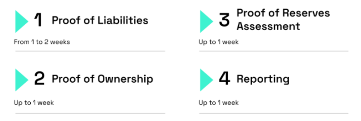

# Proof of Reserves Methodology
Release: Version 3.0

## Table of Contents
- [Intro: Building Trust Through Proof of Reserves](#intro-building-trust-through-proof-of-reserves)
  - [Proof of Reserves Goals and Objectives](#proof-of-reserves-goals-and-objectives)
- [Trust Reinforcing: Proof of Liabilities](#trust-reinforcing-proof-of-liabilities)
  - [Confidential and Private Approach](#confidential-and-private-approach)
  - [Client Liability Report](#client-liability-report)
  - [Hacken Merkle Tree & Verifier Tool](#hacken-merkle-tree--verifier-tool)
- [Unparalleled Transparency: Proof of Ownership](#unparalleled-transparency-proof-of-ownership)
  - [Proof of Ownership Value](#proof-of-ownership-value)
  - [Establishing Ownership and Trust](#establishing-ownership-and-trust)
- [Ensuring Stability: Proof of Reserves Assessment](#ensuring-stability-proof-of-reserves-assessment)
- [Elevating Proof of Reserves: Real-time Proof of Reserves](#elevating-proof-of-reserves-real-time-proof-of-reserves)
  - [Real-time Confidence](#real-time-confidence)
  - [Hacken's Proof of Reserves Service](#hackens-proof-of-reserves-service)
- [Team Composition](#team-composition)
- [Deliverables](#deliverables)

---

# Intro: Building Trust Through Proof of Reserves

## Proof of Reserves Goals and Objectives

In the dynamic and evolving world of cryptocurrency, building trust is crucial for organizations operating within this space. Hacken recognizes the unique challenges faced by organizations in the crypto industry and has developed an innovative Proof of Reserves solution, specifically tailored to address these needs.

By implementing the Hacken's Proof of Reserves service, organizations can provide verifiable evidence of their reserve holdings, reassuring customers and stakeholders that their assets are securely held and fully backed. This transparency is essential in establishing trust and differentiating organizations within the crypto industry.

At Hacken we are focused on verifying an organization's liabilities, such as customer deposits or outstanding loans, to ensure that the liabilities are accurately represented and can be met by the organization's assets.

The purpose of conducting Proof of Reserves audit is to provide transparency and assurance to stakeholders that the organization is operating in a trustworthy and responsible manner. The main objectives of a Proof of Reserves audit include confirming the existence and authenticity of cryptocurrency holdings, verifying that the amount of cryptocurrency held matches the amount claimed by the organization.

---

# Trust Reinforcing: Proof of Liabilities

## Confidential and Private Approach

At Hacken, we are committed to providing transparent and honest procedures as part of our Proof of Reserves audit methodology. We also prioritize the confidentiality and privacy of our valued customers' users.

Proof of Liabilities involves calculating all liabilities, which are the balances of in-scope assets held by your users, to form the Client Liability Report. As the Proof of Reserves auditor, we collect the minimum necessary data from users of your service to ensure their privacy is safeguarded. This may include a pair of public address/balance or UID/public address/balance, depending on the specific requirements.

## Client Liability Report

When generating the Client Liability Report, Hacken takes great care to verify the accuracy of the information received. We follow a rigorous procedure to ensure the utmost precision. Here's an overview of the steps we take:

1. **Inspection of Tables and Scripts:** 
We meticulously inspect the tables and scripts structures used by our customers to extract users IDs and balance data from their underlying databases. This scrutiny ensures that the logic and parameters are designed to pull a complete and accurate listing of client liabilities, encompassing all in-scope assets.

2. **Observing Client Access:** 
We closely observe client access to the production replica database, which is used to generate the Client Liability Report. By monitoring the execution of the aforementioned scripts, we validate the total balance of in-scope client liabilities and cross-verify the total number of records obtained from these scripts.

3. **Extraction of the Client Liability Report:** 
We oversee the generation of the Client Liability Report from the production replica database, focusing on the
report's output fields. We reconcile the total balance of in-scope client liabilities and the total number of records observed in the report extract, ensuring consistency with the figures obtained from the previous steps.

## Hacken Merkle Tree & Verifier Tool

In addition to Proof of Liabilities, Hacken performs crucial procedures for the subsequent aggregation of the Client Liability Report data within the Proof of Reserves. Here's a summary of those procedures:

1. **Utilizing the Merkle Tree Library:** 
We leverage the power of the Merkle Tree library to aggregate the client data obtained from the Client Liability Report during the assessment. This allows us to determine the Merkle Root Hash, which further enhances the integrity and security of the verification process.

2. **Random Sampling and Cryptographic Testing:** 
To validate the accuracy and validity of the Proof of Reserves PoR IDs, we randomly select a sample of 10 PoR User IDs. For each selected sample, we employ the Verifier Tool in PoR project to cryptographically test whether the PoR IDs were successfully generated and included in the Merkle Tree.
Additionally, we perform cryptographic testing on a sample 'dummy' account to ensure that only valid PoR Record IDs are included within the Merkle Tree.

With our meticulous Proof of Liabilities and subsequent aggregation procedures, Hacken ensures that the Proof of Reserves audit is conducted with the utmost accuracy, privacy, and transparency. Our commitment to these principles allows us to instill confidence in our customers and provide them with reliable and trustworthy auditing services.

---

# Unparalleled Transparency: Proof of Ownership

## Proof of Ownership Value

In the world of Proof of Reserves, it's not enough to simply obtain and publish the funds reserved by an organization or disclose its liabilities. It's about conducting thorough analysis, making comparisons, and delivering transparent results that showcase the reliability of the service to its users. At Hacken, we firmly believe that before calculating the assets held in your cryptoexchange reserves, it's essential to establish ownership of those reserves. As a trusted third-party Proof of Reserves Assessor, we ensure that the audit leaves no blind spots.

## Establishing Ownership and Trust

With the evolving blockchain ecosystem, asset ownership verification is not limited to traditional addresses. Smart contracts and off-chain solutions have expanded the horizons and methods for verification. At Hacken, we stay abreast of these advancements and offer a wider range of tools and techniques to ensure asset ownership across different contexts. Here's how we verify ownership:

1. **Single Signature Addresses:**
For each of the "single signature" addresses received, we execute one of the following methods:

   a. **On-Chain Verification**
   
      i. **Smart Contract State:** We can directly query the smart contract holding the assets to verify ownership. Most DeFi or staking smart contracts have methods to query the amount staked by a specific address. I.e.:

      ```javascript
      const stakingContract = new web3.eth.Contract(ABI, contractAddress);
      const userStake = await stakingContract.methods.balanceOf(userAddress).call();
      ```

      ii. **"Send-to-Self" Transaction:** 
        As an alternative method, we provide the client with a specific amount of cryptocurrency to execute a "send-to-self" transaction. The client shares the corresponding transaction hash with us, and we inspect the transaction details on the blockchain. By matching the amount, timestamp, and "sending" address with the specific parameters communicated, we can confirm the ownership of the address.

      iii. **Events and Logs:** 
        Some contracts emit events when assets are staked or ownership is transferred. We can filter and read these logs to validate ownership. I.e.:

      ```javascript
      const pastEvents = await stakingContract.getPastEvents('Staked', { filter: {user:
      userAddress}, fromBlock: startBlock, toBlock: 'latest' });
      ```

      iv. **Token Standards:** 
        For tokens, the ERC20 and ERC721 standards (among others) have standard methods for querying balances and ownership.

   b. **Off-Chain Verification**
   
      i. **Signed Messages:** 
        A user can sign a message using their private key. This signed message can be verified by anyone with the public address of the signer, ensuring the user has control over the address without necessitating any transactions. I.e.:

      ```javascript
      const message = "I own this address";
      const signature = web3.eth.accounts.sign(message, privateKey);
      ```

      To verify:

      ```javascript
      const recoveredAddress = web3.eth.accounts.recover(message, signature);
      ```

      ii. **Oracles:** 
        Trusted off-chain data providers can also attest to the ownership of assets, though this introduces a point of centralization.

2. **Multi-Signature Addresses:** 
In more complex scenarios involving shared ownership, multisignature wallets or contracts can be employed. In such instances, validating ownership will also involve ensuring the requisite number of signatures have been gathered to authorize operations on the staked assets.

Should there be inquiries regarding if off-chain solutions remain operative even when assets are staked, the answer is a resounding "yes." Signed messages can still serve to affirm ownership of an address, irrespective of whether assets are staked. The principle behind utilizing signed messages is to demonstrate dominion over a private key, which by implication verifies ownership of any assets associated with the corresponding blockchain address. This remains true whether said assets are liquid, staked in a contract, or otherwise engaged on-chain.

By meticulously verifying ownership through these methods, Hacken ensures the trustworthiness and credibility of the Proof of Reserves audit. We leave no stone unturned to provide you with comprehensive assurance and transparency regarding the ownership of your reserve assets. Partner with us and build trust among your users with our reliable Proof of Ownership methodology.

# Ensuring Stability: Proof of Reserves Assessment

In the final stage of our Proof of Reserve Audit methodology, the Ensuring Stability: Proof of Reserves Assessment, we provide you with a comprehensive analysis that guarantees the stability of your reserves. Through meticulous procedures, we assess the financial strength of your organization, enabling you to build trust and confidence among your users:

1. **Querying In-Kind Assets:** 
Our expert team conducts a thorough examination of all in-kind spot and staked asset addresses or keys that fall within the assessment scope. We ensure that these assets are under your control, giving you a clear picture of the assets held by your organization.

2. **Comparing Liabilities and In-Kind Assets:** 
We meticulously compare the total liabilities derived from the Client Liability Report, extracted directly from your production database, with the total assets controlled by your custodied addresses. Known as "In-Kind Assets," these represent the reserves held by your organization. By employing the In-Kind Asset-to-Client Liability mapping provided by you, we calculate the collateralization ratio. <br/><br/>
To ensure an accurate and consistent comparison of all assets and liabilities, Hacken adopts an approach based on a standard currency such as the US dollar. This approach allows for the standardization and comparison of different types of assets and liabilities in terms of their fiat value.<br/>
  - <u>Precision in Calculations:</u> Hacken is committed to ensuring the utmost precision in its calculations. Each asset and liability is processed using the maximum possible number of decimals, ensuring that each value accurately reflects its true magnitude and detail.<br/>
  - <u>Data Sources and Prices:</u> Hacken utilizes APIs from industry-leading platforms such as Binance, Kraken, CoinGecko, CoinMarketCap, and KuCoin to obtain up-to-date and accurate prices.<br/>
  - <u>Average Price Calculation:</u> Once prices are obtained from these sources, Hacken calculates the average price. This average is derived by summing the prices from all sources and dividing them by the total number of sources.<br/>
  - <u>Handling Anomalous Values:</u> To ensure that extreme or anomalous values do not distort the average price, Hacken implements the statistical method of the Median Absolute Deviation MAD. This method identifies and excludes values that significantly deviate from the median value, ensuring that the average price accurately and reliably reflects the market value.

3. **Calculating Collateral Ratios:** 
As part of our commitment to providing you with a comprehensive assessment, we calculate the collateral ratio for each individual asset. These ratios give you valuable insights into the level of collateral backing your liabilities. Our detailed report includes the collateral ratios for each asset, ensuring transparency and allowing you to make informed decisions regarding your reserve management.

By conducting meticulous queries, comparisons, and calculations, we provide you and your users with a comprehensive analysis of your reserves' stability.

**One-time Proof of Reserves audit can be completed in 2-3 weeks:**



# Elevating Proof of Reserves: Real-time Proof of Reserves

## Real-time Confidence

Hacken's real time Proof of Reserves objective is to promote transparency, trust, and security in the digital currency world. We want to allow users to verify the solvency of the exchanges without compromising their personal information. Our service ensures that clients can validate the financial health of their chosen exchanges using a simple and safe app.

## Hacken's Proof of Reserves Service

From the client side, we have a simple API in place with authentication methods where you can send the updated information from where we are going to create the Proof for final customers. We only need the user's UUID and the balance of the accounts, maintaining the user's privacy and confidentiality. On the user end, we provide an intuitive front-end interface where users can view the latest proof of solvency, the currency prices at the audit time, their full proof, and their asset details at the moment of the proof of reserves.

We believe that with our real-time proof of reserves service, we're setting a new industry standard for transparency and reliability in crypto exchanges.

# Team Composition

| # | Team Member and Role | Components to review |
|---|----------------------|----------------------|
| 1 | Lead PoR Auditor | Audit Supervision, Interview conducting, Results and Recommendations |
| 2 | PoR Auditor | Development and maintenance of Hacken's Proof of Reserves and verification tools |
| 3 | PoR Consultant | Analysis of information revealed during the interview and verification process, preparation of documentation |
| 4 | Delivery Manager | Communication & Project Management |

# Deliverables

The deliverable is the detailed Proof of Reserves audit report with audit findings and results **OR** Automated Proof of Reserves Service.
