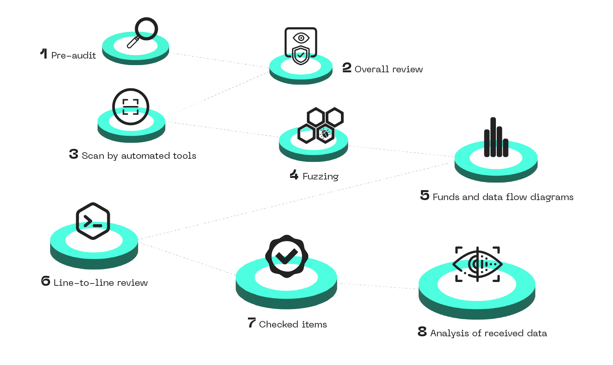
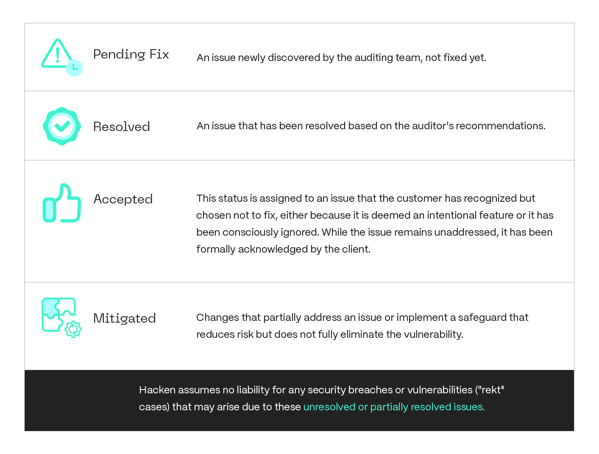

# Smart Contract Code Review And Security Analysis Methodology
Release: Version 2.3

## Table of Contents

1. [Document](#document)
2. [Part 1. Smart Contract Audits: A Bit of Background](#part-1-smart-contract-audits-a-bit-of-background)
   - [Overview](#overview)
      - [Executive Summary](#executive-summary)
   - [The Value of Smart Contracts Audit](#the-value-of-smart-contracts-audit)
      - [Audited smart contracts: why does it matter?](#audited-smart-contracts-why-does-it-matter)
      - [How Does the Audit Help?](#how-does-the-audit-help)
3. [Smart Contracts Audit and Analysis Phases](#part-2-smart-contracts-audit-and-analysis-phases)
   - [Preparations for Smart Contracts Audit and Analysis](#preparations-for-smart-contracts-audit-and-analysis)
      - [Why are preparations so important?](why-are-preparations-so-important)
      - [Functional requirements](#functional-requirements)
      - [Technical description](#technical-description)
      - [Setup development environment of the project](#setup-development-environment-of-the-project)
      - [Unit tests](#unit-tests)
      - [Code style and best practices](#code-style-and-best-practices)
   - [Code Review and Analysis](#code-review-and-analysis)
      - [Pre-audit](#pre-audit)
      - [Overall review](#overall-review)
      - [Scan by automated tools](#scan-by-automated-tools)
      - [Fuzz Testing](#fuzz-testing)
      - [Invariant Testing](#invariant-testing)
      - [Funds and data flow diagrams](#funds-and-data-flow-diagrams)
      - [Line-to-line review](#line-to-line-review)
      - [Checked Items](#checked-items)
   - [Testing](#testing)
   - [Report](#report)
   - [Remediation Check](#remediation-check)
   - [Issue Status](#issue-status)
4. [Vulnerabilities Severity Formula](#vulnerabilities-severity-formula)

---

# Document
| Name | Smart Contract Code Review And Security Analysis Methodology |
| ----------- | ----------- |
| Creators  | Hacken OU |
| Subject  | audit; security analysis; smart contracts; |
| Description  | The methodology described herein provides specific guidance on how to plan and execute an audit of smart contracts in line with the Smart Contracts Audit and Analysis Requirements provided by Hacken. |
| Contributor  | Luciano Ciattaglia | Director of Services, Hacken OU |
| Date  | September 13th, 2024 |
| Rights  | Hacken OU |

---

# Part 1. Smart Contract Audits: A Bit of Background

## Overview
### Executive summary
The Smart Contracts Audit and Analysis Methodology constitutes a response to Hacken customers’ requests and is based on years of experience in conducting smart contract audits. The purpose of this document is to illustrate the audit process to Hacken community and improve the quality of smart contract development to protect Hacken’s customers' funds and their users. 

## The value of Smart Contracts audit 
### Audited smart contracts: why does it matter?
The total market capitalization of crypto has surged to an astonishing $2.64 trillion—more than 6x growth since 2020. At the same time, the DeFi market has skyrocketed past $150 billion, experiencing a 9x increase over the same period. In 2021 alone, crypto adoption increased by an incredible 880% compared to 2020, and these numbers continue to rise. **The mass adoption of crypto is no longer just a trend—it’s becoming our new reality**. 

However, with this rapid growth comes a significant increase in security risks.. In 2020, hackers stole $1.9B worth of crypto assets, and in 2021, the DeFi segment became the primary target, with $361 million out of $681 million in hacks occurring within this space. 

It’s crucial for crypto project owners and core teams to understand the risks smart contracts involve, and they need to know how to address these threats. The most common risks related to smart contracts are operational, implementation, and design risks. If exploited, these weaknesses can severely harm a project’s competitiveness or even destroy it. 

Once deployed, smart contracts cannot be altered, which means that after a vulnerability is exploited, hackers can continue draining assets until they’re entirely stolen.

**A smart contract audit is the only effective way for projects to prevent the occurrence of serious security incidents.**

### How does the audit Help?
Most developers require guidance on how to write secure and high-quality smart contracts. Our methodology is designed to meet the needs of our customers, their technical teams, and their potential clients (community).

**With our methodology, product owners can:** 
1. Ensure that development aligns with the specified functional requirements.
2. Understand the necessary steps to take prior to the audit. 
3. Identify the steps to follow during the audit. 
4. Know what actions are required after the audit. 

 

**The value of our methodology for developers:**
1. Provides a clear understanding of the audit process and its phases.
2. Offers recommendations for ensuring secure development practices. 
3. Describes the most common mistakes.
4. Shares best practices for writing safe and secure code. 

# Part 2. Smart Contracts Audit and Analysis Phases
Smart Contracts Audit and Analysis process consists of the following phases:
1. Onboarding (Preparation)
2. Testing
3. Reporting
4. Remediations check

 

## Preparations for Smart Contracts Audit and Analysis
### Why are preparations so important?
Preparation for an audit is as necessary as the audit itself.
During the preparation, customers have the chance to review their projects one more time thoroughly to ensure that everything they have planned is implemented correctly. 
Good preparation saves both time and money that projects can later spend on additional audits. Also, at this stage, a customer can detect many issues.

**To get the maximum value from the audit, we recommend that  our customers follow these steps:**

1. Describe the functional requirements for the project.
2. Write a technical description of the project.
3. Set up the development environment of the project.
4. Prepare unit tests.
5. Ensure that the code follows best practices and security standards.

### Functional requirements
Functional requirements are essential to help us understand the needs of our customers.  

The main question that should be answered here is: **What do we want to achieve via these smart contracts?**

Functional requirements need to be clear, simple, and unambiguous. Here are some examples of well-written functional requirements:

- The contract should allow users to stake HAI tokens and receive other tokens as rewards.
- Total rewards should be divided among all users according to their % of the total volume of locked HAI.
- Users should be able to withdraw their funds and rewards whenever they want. 
- Total locked balance should be recalculated each time a user withdraws his tokens

Try to provide as many functional details as possible.

User stories can be useful as well. 

### Technical description
Technical description should contain information about the used languages and technologies, deployment instructions, instructions on how to run tests, etc. Non-functional requirements can also be included in this section.
**Non-functional requirements define how a system performs rather than what it does. They ensure qualities like performance, security, and usability, for example:**

1. Scalability: The contract should handle 100,000 transactions simultaneously.
2. Security: Only authorized users can stake or withdraw funds.

### Setup development environment of the project
A development environment for the project should be configured by the customer. Truffle, Hardhat, or any other comprehensive development environment can be used. A proper description of the environment should be provided. An example of the project environment configuration can be found **[here](https://github.com/hknio/sample_solidity_project)**.

### Unit tests
All code must be covered by unit tests, achieving 100% test coverage that includes both positive and negative scenarios.  Test cases should simulate contract usage by multiple users to prevent DoS attacks and ensure that one user's operations do not interfere with another's unless specified in the requirements. Tests should be executed on the emulated VM without the need to run local VM’s or connect to testnets.

We recommend using TDD during the development process.

### Code style and best practices
We strongly recommend following the official code style guides and formatting your code before submitting it for audits. Code readability and compliance with the language style guide are some of the factors that determine the code recommendations. Furthermore, to expedite the bug-fix verification process, it is essential to format the code before the initial audit. This approach reduces the time required for verifying issues and minimizes the likelihood of overlooking errors in newly added code.

## Code review and analysis
Code review and analysis is performed by lead and assistant auditors across the whole process. Additional quality reviews are performed by an expert auditor to verify that all good security practices were performed during the workflow. All steps of this process:

### Pre-audit
The purpose of the pre-audit phase is to help customers understand how their project is being prepared for the audit and identify any areas that need improvement. Depending on the audit timeline, improvements can be made either before the actual audit or during the audit. 

### Overall review
At this step, lead and assistant auditors read the code to understand its structure and purpose. Functional and technical requirements, along with other documents provided by clients are examined in detail. At this stage, no serious findings can be identified. The main outcome of this step is a high-level description of the code,  which will be used internally in the subsequent steps of the audit. 

### Scan by automated tools
Automated tools are used to search for simple issues and provide more information about smart contracts under review. The following tools are used: 

#### Solidity:

- Slither - Static analysis of Solidity source code for security vulnerabilities and best practices. 
- Mythril - Reversing and bug hunting framework for the Ethereum blockchain.
- Solgraph - Generates a DOT graph that visualizes function control flow of a Solidity contract and highlights potential security vulnerabilities.
- Echidna - program designed for fuzzing/property-based testing of Ethereum smart contracts.
- And other proprietary tools.

#### Rust:

- Clippy - A collection of lints to catch common mistakes and improve your Rust code. 
- Cargo-udeps - Find unused dependencies in Cargo.toml.
- Cargo-audit - Audit your dependencies for crates with security vulnerabilities reported to the RustSec Advisory Database.
- Cargo-geiger - detect usage of unsafe Rust.
- Cargo-crev - cryptographically verifiable code review for cargo.
- And other proprietary tools.

### Fuzz Testing
During the testing stage of a smart contract audit, at least one auditor will focus on performing fuzz testing to ensure that even the most obscure edge cases are covered. Fuzz testing, or fuzzing, is especially valuable for complex projects where traditional testing methods may not uncover all potential vulnerabilities. 

#### Invariant Testing
Invariant testing ensures that certain conditions or properties (invariants) of a smart contract remain true throughout its execution. Invariants are critical properties that must always hold, regardless of transaction sequences or state changes. Testing these ensures the contract's integrity, correctness, and security.

#### Why Fuzzing is Needed:
Traditional testing methods often struggle to identify edge cases and unforeseen scenarios; this is where fuzzing shines. By injecting random or invalid data into the contract, fuzzing explores uncharted territories and exposes vulnerabilities that might otherwise remain hidden. Think of it as a stress test, pushing the contract beyond its expected boundaries to discover potential points of failure. This helps ensure that the contract behaves as expected under all possible conditions, ultimately enhancing the overall security and reliability of the smart contract.

#### Types of Fuzzing:

1. **Stateless Fuzzing:** Stateless fuzzing involves testing a smart contract by randomly generating inputs or transactions without considering the state of the contract or previous interactions. In this approach, each input or transaction is treated independently, and the focus is on exploring the contract's behavior under various conditions without any prior knowledge of its state. Stateless fuzzing is useful for quickly identifying vulnerabilities or edge cases that could lead to unexpected outcomes. However, it may overlook issues related to the contract's state dependencies or interactions between different transactions.

2. **Stateful Fuzzing:** Stateful fuzzing, on the other hand, takes into account the current state of the smart contract and its interactions with previous transactions. Instead of treating each input in isolation, stateful fuzzing aims to simulate realistic usage patterns by maintaining a model of the contract's state and executing transactions based on this model. This approach allows for more thorough testing of smart contracts, as it can uncover vulnerabilities related to state transitions, reentrancy, or unexpected interactions between different parts of the contract. Stateful fuzzing typically requires more computational resources and complexity compared to stateless fuzzing but can provide deeper insights into the contract's behavior and security properties.

#### Stages of a Fuzz Test:

1. **Tool Selection:** The first step is to select the appropriate fuzzing tool based on the project's protocol and programming language. For instance, [Echidna](https://github.com/crytic/echidna) is often used for Solidity-based smart contracts, while [cargo-fuzz](https://github.com/rust-fuzz/cargo-fuzz) is suitable for projects written in Rust.

2. **Identifying Invariants:** Next, identify the invariants of the smart contract. In the context of smart contracts, an invariant is a condition or property that should always hold true, regardless of the contract’s state or the inputs it receives. Common invariants include conditions like “the total supply of tokens should not exceed a predefined limit” or “a contract’s balance should always be non-negative.”

3. **Execute Fuzz Tests:** Perform multiple fuzzing runs to test all identified invariants, ensuring that the contract maintains its integrity across a wide range of scenarios. Each run helps to verify that the contract behaves as expected, even when subjected to unforeseen or malicious inputs.

By incorporating fuzz testing as a standard practice in smart contract audits, auditors can significantly enhance the security and robustness of the contracts, providing greater assurance that they will perform as intended in the real world.

### Funds and data flow diagrams
At this step, auditors have more information about the code and can now build funds and data flow diagrams. We visualize all possible states of the contract and all its interactions with other contracts. All changes of data and funds flow should be displayed on those diagrams. 

During this step, some issues can be found and recorded by auditors.

This allows us to understand smart contracts before line-to-line review better.

BPMN and UML diagrams are used to visualize funds and data flows

### Line-to-line review
During the line-to-line review, auditors thoroughly read each line of the code and record every issue detected. We review contracts for all known issues such as the ones described in **[SWC](https://swcregistry.io/docs/SWC-100)**. We also look for possible data manipulations, access violations, flash loans, and other manipulations that can be performed through interaction with other contracts. This step also includes validation of the code according to code-style guides and best practices.

### Checked Items
Items differ for each language and platform that we audit smart contracts for. 

You can find our detailed checklist per language and platform here: [Hacken full checklist](./sc-checklist.md)

### Analysis of received data
All auditors review their findings and audit artifacts, and share results internally. Auditors prepare materials for the report. An expert auditor reviews all materials prepared by the lead auditor and performs a quality review of the report. Most possible issues are already documented at this step.

## Testing
During the testing phase of the audit, if unit tests are configured for the project, auditors check coverage and write their own test cases if required. Ideally, code coverage should cover all positive and negative cases. Some issues can be reproduced with invalid config of dependency contracts. Auditors create such configs and run corresponding tests. 

If unit tests are not configured, auditors deploy smart contracts on the local network and check all required cases. 

Some sophisticated issues require complex exploiting contracts. Usually, if it is unclear how the issue can be exploited, auditors provide the sample attacking contracts. 

## Report
After all code review, analysis, and tests, auditors prepare a report. Reports have the following structure:
- Introduction	
- Scope	
- Audit Summary
- System Overview	
- Risks
- Findings
- Definitions
- Disclaimers

## Remediation Check
All issues are reported to the customer in the preliminary report. If some points are unclear, we can provide more descriptions of issues or explain everything on a call.

The customer is entitled to one complimentary remediation check if the following conditions are met:
- **Timely Response:** Remedial actions must be implemented within the specified timeframe dictated by the Lead Auditor.
- **Code Integrity:** The fundamental code structure should remain unchanged. Major architectural modifications may disqualify the customer from a free remediation check.
- **Documentation:** All modifications to the code must be comprehensively documented by the customer, detailing what changes were made and why.
- **Commit Specificity:** The submitted commits must exclusively address the vulnerabilities or issues that were identified in the "Findings" section of the preliminary report.

Fixes must be submitted in a structured list, detailing the Finding ID and the corresponding commit hash.

After all fixes are validated, a final report is provided to the customer.

## Issue Status
During the auditing, an issue can have one of the following statuses:

 

# Vulnerabilities severity formula
### [Hacken OÜ - Severity Formula Standart](https://github.com/hknio/severity-formula/blob/main/README.md)